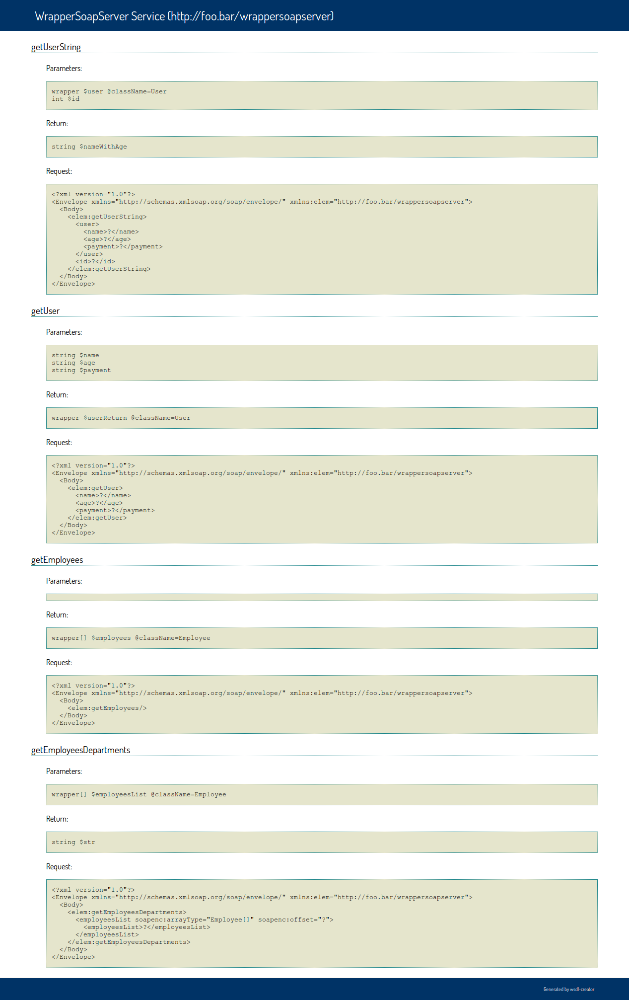

PHP WSDL Creator
================

[](https://travis-ci.org/Georgo/wsdl-creator)
[](https://scrutinizer-ci.com/g/georgo/wsdl-creator/)
[](https://coveralls.io/r/georgo/wsdl-creator)
[](https://www.versioneye.com/user/projects/56e6bf4596f80c00362cd6ba)

Introduction
------------

WSDL creator allows generating WSDL documents based on PHP classes using annotations and reflection mechanism. This generator also give possibilty to generating overview methods and parameters with SOAP examples used in WSDL.

Support: >= PHP5.3.

Installation
------------

To install wsdl-creator at your project use [composer](http://getcomposer.org).

###Create new project:

`composer.phar create-project georgo/wsdl-creator myproject`

###or add to the composer.json file:

```
require: {
	"georgo/wsdl-creator": "1.*"
}
```


Configuration
-------------

To start working with creator you must create new `WSDLCreator` object and define for him:
* class to generate `WSDL`
* `SOAP` server location
* documnet namespace.

```php
$wsdl = new WSDL\WSDLCreator('ClassName', 'http://localhost/wsdl-creator/ClassName.php');
$wsdl->setNamespace("http://foo.bar/");
```

`SOAP` server must be created in location specified in `WSDLCreator`.

```php
$server = new SoapServer(null, array(
    'uri' => 'http://localhost/wsdl-creator/ClassName.php'
));
$server->setClass('ClassName');
$server->handle();
```

To render `XML` use method `renderWSDL`. To properly load generator classes use composer loader which is in `vendor/autoload.php`.

Full configutaion listing:

```php
require_once 'vendor/autoload.php';

use WSDL\WSDLCreator;

if (isset($_GET['wsdl'])) {
    $wsdl = new WSDL\WSDLCreator('ClassName', 'http://localhost/wsdl-creator/ClassName.php');
    $wsdl->setNamespace("http://foo.bar/");
    $wsdl->renderWSDL();
    exit;
}

$server = new SoapServer(null, array(
    'uri' => 'http://localhost/wsdl-creator/ClassName.php'
));
$server->setClass('ClassName');
$server->handle();
```

Now if we try call address `http://localhost/wsdl-creator/ClassName.php?wsdl` you recive `WSDL` document.

Define web service method
-------------------------

To define is a web service method you must use `@WebMethod` annotation.


Simple type
-----------

Simple types are described [here](http://infohost.nmt.edu/tcc/help/pubs/rnc/xsd.html#xsd-types).

###Usage

```
/**
* @param string $name
*/
```

So you type `@param` next type one of simple types (`string`) after name of variable (`$name`).

---

You can also use `arrays` of the simple types.

###Usage

```
/**
* @param string[] $names
*/
```

In input parameter now you must define what type of array you pass (`string[]`).

---

###Example

[SimpleTypeExample](examples/SimpleExampleSoapServer.php)

---

###Annotations

- @desc Method description
- @param type $varialbe_name
- @return type $return

Wrapper type
------------

Wrapper types are user defined clases which you can generate `WSDL` complex types.

###Usage

```
/**
* @param wrapper $user @className=User
*/
```

You must define class `User` with public fields and doc comments which contains field type as example:

```php
class User
{
	/**
	* @type string
	*/
	public $name;
	/**
	* @type int
	*/
	public $age;
}
```

This mechanism use [reflection](http://php.net/manual/en/book.reflection.php), i.e. `User` class must be visible to the generated class - possible use [namespaces](http://php.net/manual/en/language.namespaces.php) (`\Namespace\To\User`).

---

You can define arrays of wrappers.

###Usage

```
/**
* @return wrapper[] $users @className=User
*/
```

This annotation will generate array of users.

---

###Example

[WrapperTypeExample](examples/WrapperExampleSoapServer.php)

---

###Annotations

- @desc Method description
- @param wrapper[] @className=ClassName
- @return wrapper @className=\Namespace\To\ClassName

Object type
-----------

You can dynamically create object at runtime. Use `object` parameter type.

###Usage

```
/**
* @param object $info @string=$name @int=$age
*/
```

This annotation create complex type with `name` and `age` elements.

---

Also you can wrapp classes in object.

###Usage

```
/**
* @return object $userNameWithId @(wrapper $user @className=User) @int=$id
*/
```

Above example will return `UserNameWithId` object which contains pointer to `User` complex type and `int` type.

---

Another option is creating array of objects.

###Usage

```
/**
* @param object[] $payments @float=$payment @string=$user
*/
```

This annotation creata array of objects with `payment` and `user` on each element of array.

---

###Example

[ObjectTypeExample](examples/ObjectExampleSoapServer.php)

---

###Additional info

In `object` you can use array of wrappers and array of simple types.

---

###Annotations

- @desc Method description
- @param object $object @type1=$name1 @type2=$name2
- @param object $object @(wrapper $nameWrapper @className=User) @type1=$name1
- @param object[] $object @type1[]=$name1
- @return

Service overview
----------------
You can generate service overview through `renderWSDLService` method. This show all infos about method and parameters used in service with sample `SOAP` *request*.

###Example



Styles
------
By default, the `WSDLCreator` will generate WSDLs using the rpc/literal binding style.

To specify rpc/encoded or a wrapped document/literal binding style, set the binding style on the `WSDLCreator` object.

```php
$wsdl = new WSDL\WSDLCreator('ClassName', 'http://localhost/wsdl-creator/ClassName.php');
@wsdl->setBindingStyle(new WSDL\XML\Styles\RpcEncoded());
$wsdl->setNamespace("http://foo.bar/");
```

When specifying the wrapped document/literal binding style, you can use `WSDL\DocumentLiteralWrapper` to automatically wrap the returning value in an appropriate wrapped object.

```php
require_once 'vendor/autoload.php';

use WSDL\DocumentLiteralWrapper;
use WSDL\WSDLCreator;
use WSDL\XML\Styles\DocumentLiteralWrapped;

if (isset($_GET['wsdl'])) {
    $wsdl = new WSDLCreator('ClassName', 'http://localhost/wsdl-creator/ClassName.php');
    @wsdl->setBindingStyle(new DocumentLiteralWrapped());
    $wsdl->setNamespace("http://foo.bar/");
    $wsdl->renderWSDL();
    exit;
}

ini_set('soap.wsdl_cache_enabled', '0');
$server = new SoapServer('http://localhost/wsdl-creator/ClassName.php?wsdl', array(
	'style' => SOAP_DOCUMENT,
	'use' => SOAP_LITERAL,
));
$server->setObject(new DocumentLiteralWrapped(new ClassName()));
$server->handle();
```
